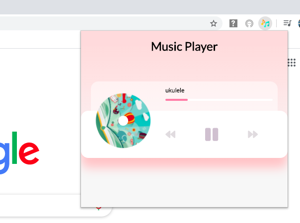
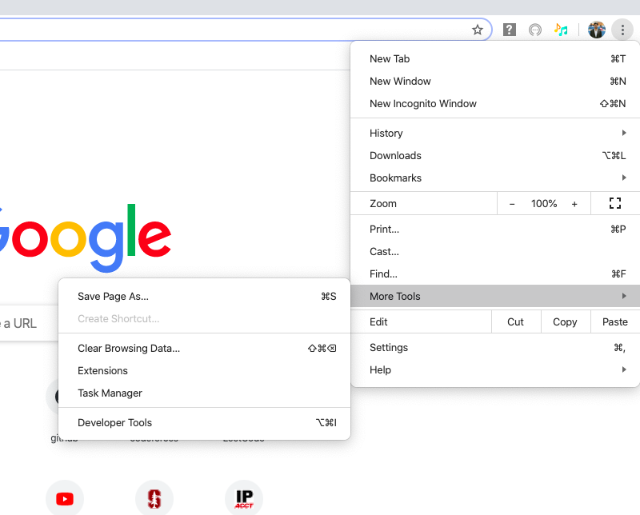

## Music Player

A beautiful UI chrome extension to play music stored in the "music folder" using the HTML5 audio API
# Screenshot

# Add to your chrome 
>To open up your extensions page, click the menu icon (three dots) at the top right of Chrome, point to “More Tools,” then click on “Extensions.” You can also type chrome://extensions/ into Chrome's Omnibox and press Enter.

>Then click Load unpacked  open this folder where manifest.jason is located

You are all set!!!